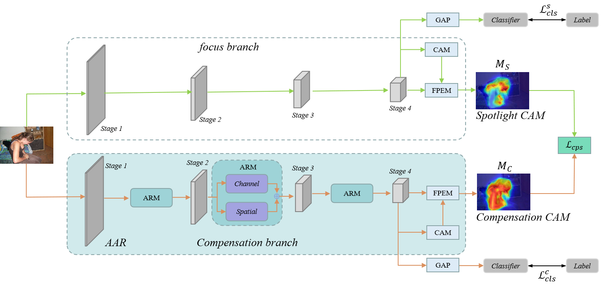
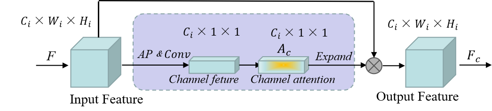
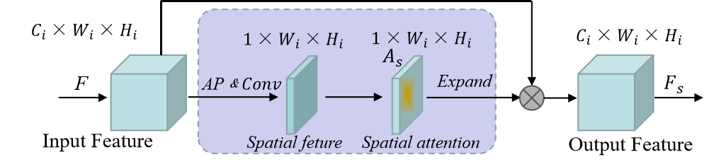

# AAR：Attention Remodulation for Weakly Supervised Semantic Segmentation

Weakly Supervised Semantic Segmentation (WSSS) is a crucial task in computer vision. However, existing methods that utilize Class Activation Maps (CAMs) with classification tasks can only identify a small part of the region. To address this limitation, we propose a novel Attention Activation Remodulation (AAR) scheme that leverages traditional CAMs and the remodulation branch to obtain weighted CAMs for recalibrated supervision. The AAR scheme re-arranges important features' distribution from the channel and space perspectives, which regulates segmentation-oriented activation responses. In addition, we propose a Feature Pixel Extraction Module (FPEM) that utilizes contextual information to improve pixel prediction. Furthermore, the proposed scheme can be combined with other methods to improve overall performance. Extensive experiments on the PASCAL VOC 2012 dataset demonstrate the effectiveness of the AAR mechanism and FPEM module.


## Overview







## Prerequisites

* Linux
* python 3.8
* pytorch 1.8.1
* torchvision 0.9.1
* NVIDIA GPU
* CUDA 11.1

## Preparation

#### Dependencies

```
pip install -r requirements.txt
```

#### Dataset

Download PASCAL VOC 2012 follwing instructions in http://host.robots.ox.ac.uk/pascal/VOC/voc2012/#devkit.

## Pretrained model

The pretrained model can be download in [link](https://pan.baidu.com/s/1YDwKHZExO55gZqOwl0gqIw).
Extraction code: mepu.

## Run

```
python run_sample.py --train_amr_pass True --make_cam_pass True --eval_cam_pass True
```

### Eval

```
python run_sample.py --make_cam_pass True --eval_cam_pass True
```

## Acknowledgement

We would like to thank the [irn](https://github.com/jiwoon-ahn/irn) and the [AdvCAM](https://github.com/jbeomlee93/AdvCAM) for their open-source projects.
